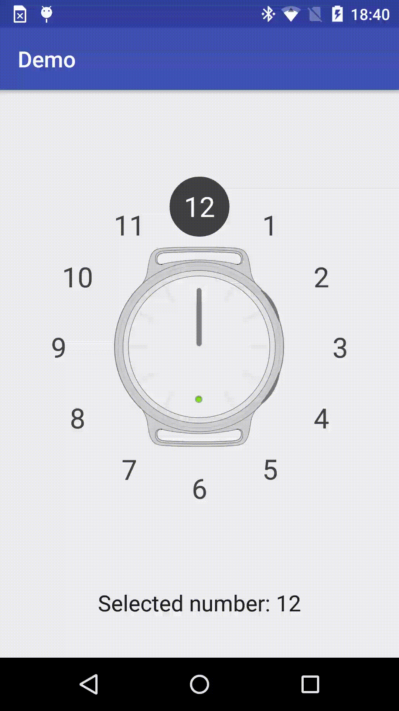
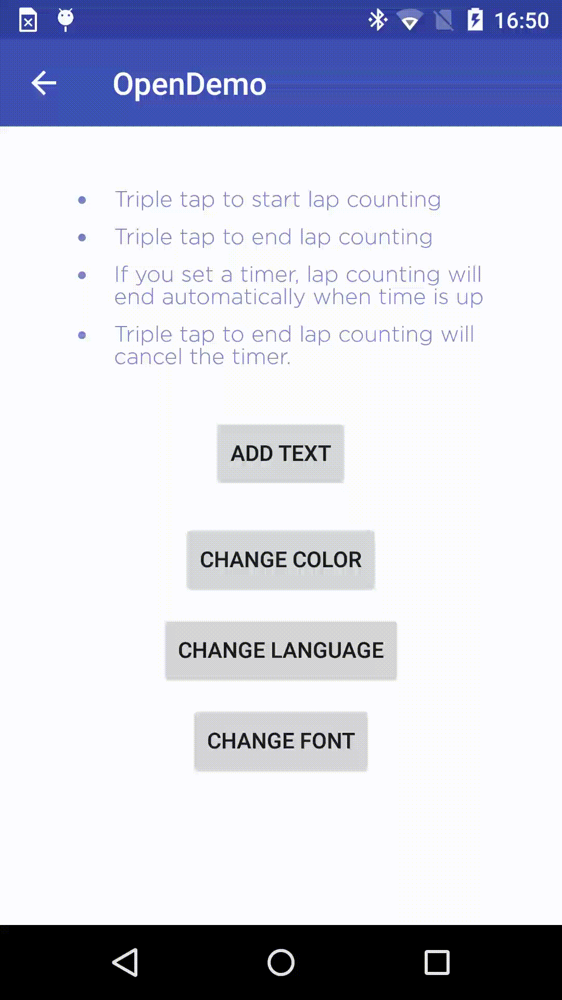

# Open Demo
Open Demo is one of my side project, the major purpose is to list all my demo for future use, 
or you can give me some suggestions if you find any inconvenient。 

# 1. ClockNumberSelector
A custom view for user to select a clock number to set a alarm or notification

#### Demo as below

### 2. InstructionView
Sometime we need show some instructions to tell user how to control the smart device, like below:
<pre>
· Triple tap to start lap counting.
· Triple tap to end lap counting.
· If you set a timer, lap counting will end automatically when time is up.
· Triple tap to end lap counting will cancel the timer.
</pre>

It will be too stupid to just add several TextViews into a LinearLayout, this is so inefficient, 
what if we wanna change color or font, then we have to change it one by one, so this is a question, 
so I decided to implement a instruction view myself.

For this instruction view, support: 
##### Support RTL layout.

##### Font changing.

##### Color changing. 

##### Add text dynamically. 
